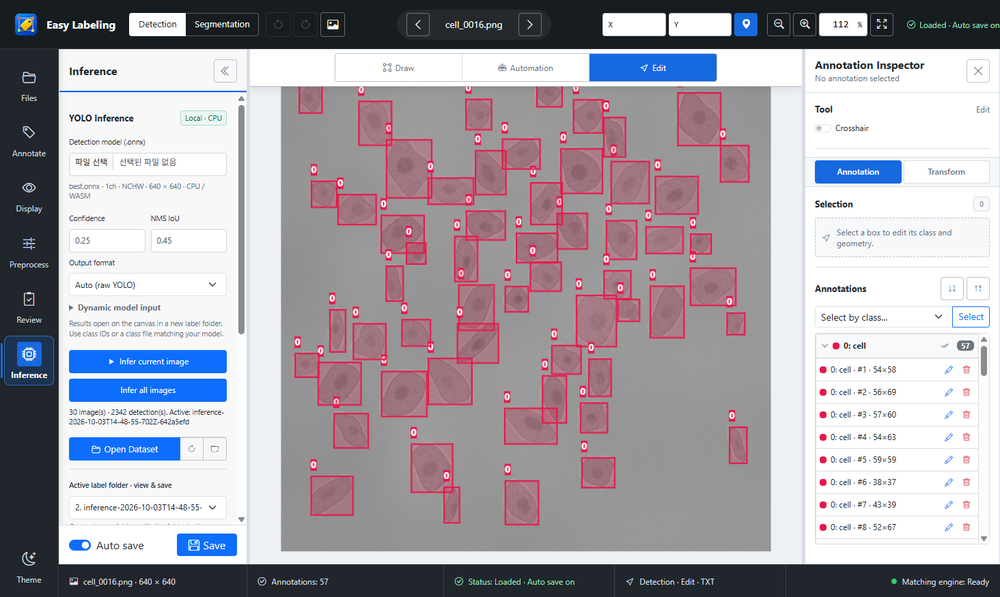
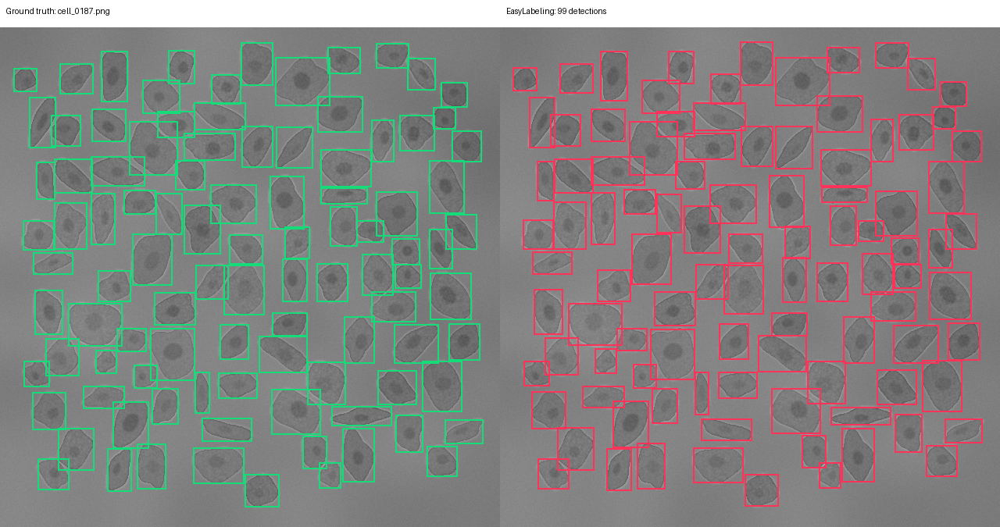

# ym_yolo 실제 학습 모델 추론 검증 — 2026-10-03

EasyLabeling의 Electron 로컬 실행에서 실제 YOLO ONNX 모델 3개와 총 64장(model-image 실행 수)의 이미지 추론을 확인했습니다. 모델 로딩, 1ch/3ch 자동 처리, 배치 추론, YOLO 라벨 저장, 캔버스 표시, Auto save가 켜진 상태에서 원본 라벨 폴더 복귀와 파일 보존이 모두 PASS입니다. 추가 애플리케이션 코드 수정은 필요하지 않았습니다.

세포 데이터는 `C:\Git\ym_yolo\datasets\synthetic_cells`의 **합성 세포 test 30장**입니다. 서로 다른 세포 모델 2개에 같은 30장을 사용했으므로 고유 이미지 수는 사각형 4장 + 세포 30장 = 34장입니다. 실제 현미경 촬영 영상의 정확도를 뜻하지 않습니다.

## 모델과 입력

| 구분 | 원본 모델 | 입력 | 출력 | 데이터 |
|---|---|---|---|---|
| 기존 smoke | `ym_yolo\results\exports\detect\smoke\best.onnx` | float32 `[1,1,128,128]` | `[1,5,336]` | `example_detect/images/val` 4장 |
| 세포 1ch 축소 | `ym_yolo\results\benchmarks\widths_20261003\w0844_repeat1\training\weights\best.pt` | float32 `[1,1,640,640]` | `[1,5,8400]` | `synthetic_cells/images/test` 30장 |
| 세포 3ch | `ym_yolo\results\benchmarks\yolo26m_entrypoints_20261002\repeat1_3ch\training\weights\best.pt` | float32 `[1,3,640,640]` | `[1,5,8400]` | 같은 test 30장 |

기존 Detection ONNX는 그대로 복사해 사용했습니다. 최신 세포 checkpoint에는 기존 ONNX가 없어서 **원본 checkpoint를 복사한 뒤** Ultralytics 8.4.168에서 ONNX로 변환했습니다. 조건은 CPU export, FP32, batch 1, 고정 640px, opset 18, `nms=None`, `simplify=False`입니다. 원본 `ym_yolo` 모델·데이터·프로젝트 파일은 수정하지 않았습니다.

생성된 ONNX 파일:

- [기존 1ch smoke](../output/ym-yolo-inference-20261003/models/smoke_1ch/best.onnx)
- [1ch 세포 축소 모델](../output/ym-yolo-inference-20261003/models/cells_1ch_w0844/best.onnx)
- [3ch 세포 모델](../output/ym-yolo-inference-20261003/models/cells_3ch/best.onnx)

각 원본/ONNX SHA-256, 크기, 입력·출력, metadata는 [models.json](../output/ym-yolo-inference-20261003/models.json)에 있습니다. 두 세포 모델은 내부 폭과 학습 실행도 다르므로 이 결과로 채널 수만의 정확도·속도 차이를 분리할 수는 없습니다.

## 검출 결과

조건: Confidence **0.25**, 클래스별 NMS IoU **0.45**, 최대 검출 **300개/장**. 정답 평가는 클래스가 같고 bbox IoU **0.50 이상**인 박스를 신뢰도 순서로 일대일 대응시켜 전체 이미지의 TP/FP/FN을 합산했습니다.

| 모델 | 이미지 | 정답 객체 | 검출 | TP | FP | FN | Precision | Recall | F1 |
|---|---:|---:|---:|---:|---:|---:|---:|---:|---:|
| 기존 1ch smoke | 4 | 4 | 0 | 0 | 0 | 4 | — | 0.00% | 0.00% |
| 1ch 세포 축소 | 30 | 2,342 | 2,342 | 2,341 | 1 | 1 | **99.96%** | **99.96%** | **99.96%** |
| 3ch 세포 | 30 | 2,342 | 2,345 | 2,341 | 4 | 1 | **99.83%** | **99.96%** | **99.89%** |

검출 0개인 smoke의 Precision은 분모가 0이므로 표에서는 표시하지 않았습니다. JSON 집계에는 계산용 0을 저장했습니다. 위 지표는 해당 Confidence/IoU에서의 P/R/F1이며 **mAP가 아닙니다**.

기존 smoke ONNX의 최대 raw class confidence는 4장 모두 **0.0123361**로, 0.25 이상 후보가 0개입니다. Python ONNX Runtime에서도 검출 0개였으며 앱 로딩·채널 변환·파일 저장은 정상입니다. 원본 프로젝트의 1 epoch smoke checkpoint는 실행 경로 확인용이고, 이 설정에서 유효한 검출 모델로 사용할 수 없습니다. 근거: [smoke-score-audit.json](../output/ym-yolo-inference-20261003/smoke-score-audit.json).

오류가 있었던 세포 이미지:

| 모델 | 이미지 | 결과 |
|---|---|---|
| 1ch | `cell_0098.png` | 정답 80개, 검출 79개, 미검출 1개 |
| 1ch | `cell_0222.png` | 정답 66개, 검출 67개, 오검출 1개 |
| 3ch | `cell_0016.png`, `cell_0051.png`, `cell_0091.png`, `cell_0221.png` | 각각 오검출 1개 |
| 3ch | `cell_0098.png` | 미검출 1개 |

전체 이미지별 검출·정답·TP/FP/FN·시간은 [per-image.csv](../output/ym-yolo-inference-20261003/per-image.csv)에 있습니다.

## 독립 참조 구현과 일치

`ym_yolo` 가상환경의 Python ONNX Runtime CPU와 프로젝트의 원본 Ultralytics `LetterBox`, `non_max_suppression`, `scale_boxes`로 참조 결과를 생성했습니다. Python 참조는 별도 전처리·ONNX 실행·후처리를 사용합니다. 앱의 실제 Worker 응답을 기록해 비교했으며, 참조 결과를 앱에 넣어 표시한 것이 아닙니다.

| 모델 | 앱 검출 / 참조 검출 | IoU ≥ 0.999 대응 | 최대 좌표 차이 | 최대 Confidence 차이 |
|---|---:|---:|---:|---:|
| 1ch smoke | 0 / 0 | 해당 없음 | 해당 없음 | 해당 없음 |
| 1ch 세포 | 2,342 / 2,342 | 2,342개 전체 | 0.0001221px | 0.0000005364 |
| 3ch 세포 | 2,345 / 2,345 | 2,345개 전체 | 0.0001526px | 0.0000024438 |

1ch 최소 대응 IoU는 0.9999954, 3ch는 0.9999916입니다. grayscale 원본을 3ch 모델 입력으로 복제하는 경로도 확인했습니다. 1ch와 3ch에서 보인 오검출/미검출은 Python 참조에도 동일하게 나타납니다.

## 실행 시간과 파일 보존

Windows / Ryzen 7 7800X3D에서 Electron ONNX Runtime **CPU/WASM, Worker 1 thread**로 실행했습니다. GPU 추론 측정은 아닙니다.

| 모델 | 모델 선택 → 준비 | Worker 평균/장 | 전체 배치 완료 |
|---|---:|---:|---:|
| 1ch smoke | 0.98s | 19.80ms | 2.99s / 4장 |
| 1ch 세포 | 0.98s | 1,571.58ms | 50.01s / 30장 |
| 3ch 세포 | 0.99s | 2,155.26ms | 68.02s / 30장 |

Worker 시간은 이미지 raster 전달 이후 전처리·ONNX 실행·후처리·응답을 포함합니다. 배치 시간에는 이미지 디코딩, 결과 파일 저장, Review 갱신과 캔버스 표시까지 포함합니다. 첫 실행/OS cache/다른 작업에 따라 변하며 단일 측정입니다. Python 참조 실행과 겹치지 않는 최종 실행 값을 사용했습니다.

원본 이미지·라벨은 별도 검증 workspace에 복사했습니다. 세 작업 모두 원본 소스로 전환하면 처음 보였던 박스 수가 복원됐습니다(사각형 1개, 세포 첫 이미지 57개). Auto save가 켜진 상태에서도 원본 라벨이 변경되지 않았고, 프로젝트 원본 이미지/라벨과 복사본의 SHA-256 일치도 확인했습니다.

실제 결과 폴더:

- [smoke 라벨](../output/ym-yolo-inference-20261003/workspaces/smoke_1ch/inference-2026-10-03T14-48-39-735Z-7d83abbf)
- [1ch 세포 라벨](../output/ym-yolo-inference-20261003/workspaces/cells_1ch_w0844/inference-2026-10-03T14-48-55-702Z-642a5efd)
- [3ch 세포 라벨](../output/ym-yolo-inference-20261003/workspaces/cells_3ch/inference-2026-10-03T14-49-58-966Z-a5127a92)

EasyLabeling에서 각 `workspaces/<모델명>`을 데이터셋으로 열고 해당 `inference-...` 폴더를 라벨 폴더로 연결하면 원본과 결과를 비교할 수 있습니다.

## 화면과 재현





[3ch 화면](../output/ym-yolo-inference-20261003/cells_3ch-app.png), [3ch 정답 비교](../output/ym-yolo-inference-20261003/cells_3ch-comparison.png).

```powershell
cd C:\Git\easy_labeling
# 현재 빌드된 앱으로 실행합니다. 소스를 변경했다면 먼저 npm run build.
node output/ym-yolo-inference-20261003/verify.mjs
& C:\Git\ym_yolo\.venv\Scripts\python.exe output/ym-yolo-inference-20261003/reference.py
& C:\Git\ym_yolo\.venv\Scripts\python.exe output/ym-yolo-inference-20261003/analyze.py
```

재현 실행은 새로운 inference 결과 폴더를 생성합니다. 기존 결과를 삭제하지 않습니다. GUI는 숨긴 Electron 검증창을 사용하며 production preload와 `file://` Worker를 그대로 실행합니다. IPC 폴더 선택만 검증 workspace로 지정했습니다.

기계 판독용 요약: [summary.json](../output/ym-yolo-inference-20261003/summary.json). UI 실행/Worker 전체 증거: [app-results.json](../output/ym-yolo-inference-20261003/app-results.json), [Python 참조](../output/ym-yolo-inference-20261003/reference-results.json), [실행 로그](../output/ym-yolo-inference-20261003/app-run.log).

초기 검증 스크립트는 데이터셋 로딩 완료 전에 박스 수를 읽어 초기값을 0으로 기록했습니다. 완료된 추론 결과는 보존하고, 정답 박스가 캔버스에 로드될 때까지 기다리도록 검증 스크립트를 수정해 세 모델을 다시 실행했습니다. 이 보고서는 수정된 최종 실행만 집계했습니다. 최초 실행 증거도 `initial-app-results.json`, `initial-app-run.log`에 보존했습니다.
