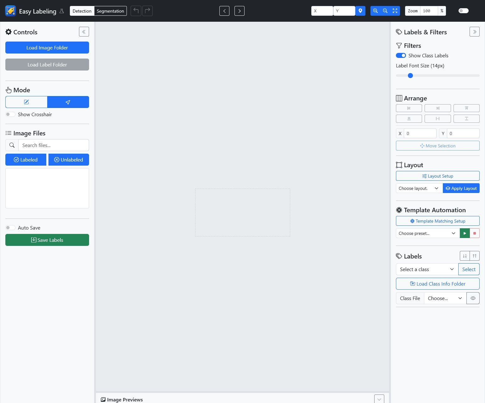
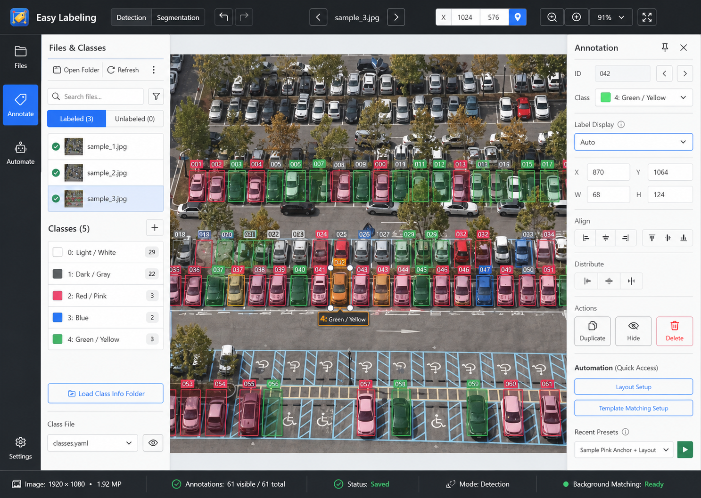
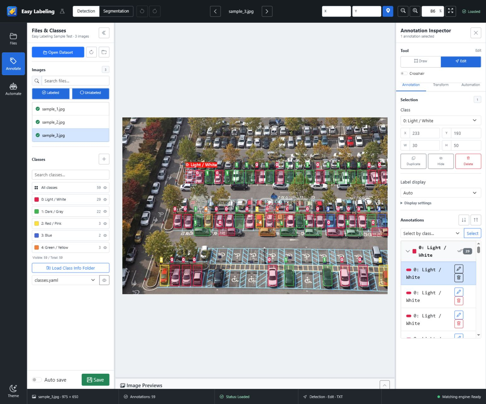

# Easy Labeling Task Mode UX Audit

## Scope

- Product: Easy Labeling 27.5.25
- Primary environment: Windows desktop, Detection and Segmentation workflows
- Representative layouts: HD (1280x720), FHD (1920x1080), QHD (2560x1440), UHD uses the same desktop layout above 1280px
- Secondary layout check: iPad-class landscape (1366x1024), sample/browser use only
- Evidence state: bundled `sample_3.jpg`, Detection, Auto label display, one annotation selected

## Before And After

### Before

The empty canvas did not provide a clear next action, unsupported folder APIs stopped the whole app, and unrelated controls competed at the same visual level.

### Approved Direction

### Implemented

The implemented workbench preserves the existing Bootstrap, Bootstrap Icons, Fabric, YOLO TXT, mask PNG/JSON, classes YAML, and automation-library contracts.

## Audit Findings

| Severity | Finding | Evidence | Implemented response | Verification |
| --- | --- | --- | --- | --- |
| P0 | Missing File System Access API blocked sample use | Unsupported-browser E2E | Folder-only actions are disabled with an inline compatibility notice; bundled Sample remains available | `unsupported-env.spec.ts` |
| P0 | Workflow switching could reset content/history | Detection and Segmentation share one canvas lifecycle | Per-workflow document snapshots and history are preserved without reloading the image | `workflow-switching.spec.ts` |
| P0 | Save state was not continuously visible | Save state previously depended on individual controls | Header and status bar expose loaded, dirty, saving, saved, auto-saved, and failed states | unit tests and `sample-test-data.spec.ts` |
| P0 | Dense full labels obscured objects | 59-box sample and 500-box synthetic data | Auto/Full/Compact/Selected/Off renderer with clipping, collision priority, viewport culling, and cached RAF updates | `annotation-label-renderer.test.ts` |
| P1 | Detection controls were arranged as one long toolbox | Repeated movement between unrelated right-panel sections | Files/Classes, Canvas, and Inspector are separated; Inspector uses Annotation/Transform/Automation tabs | final design comparison |
| P1 | Layout placement had no pre-apply spatial feedback | Out-of-image and overlap errors were discovered after apply | Canvas ghost preview shows class IDs, bounds, outside-image warnings, and collisions before apply | automation E2E and layout unit tests |
| P1 | Template setup exposed all complexity at once | Relation/Manual Offset and preprocessing were hard to scan | Five-step setup, Advanced disclosure, Anchor Offset/Final Adjustment naming, overlay, score, candidates, and timing | `automation-workflow.spec.ts` |
| P1 | Batch execution lacked a strong confirmation/result model | Destructive policy was easy to miss | Target count, policy, dry run, confirm, cancel-after-current, retry, and per-file results | batch unit tests and automation E2E |
| P1 | Modal focus could escape while OpenCV warmed | Keyboard test closed the modal before opener re-enabled | Explicit focus trap and delayed focus restoration | `sample-test-data.spec.ts` |
| P2 | Narrow icon controls clipped the connected label-folder name | 1280px DOM bounds check | Status is conveyed by icon, tooltip, and accessible name instead of inline folder text | browser accessibility check |

## Information Architecture

| Region | Responsibility | Primary actions |
| --- | --- | --- |
| Command bar | Global workflow and view context | Detection/Segmentation, Undo/Redo, image navigation, coordinates, zoom, save state |
| Task rail | Work-mode switching | Files, Annotate, Automate, Theme |
| Files & Classes | Dataset scope | Open/refresh dataset, image search/filter/list, class search/filter, class file, save |
| Canvas | Primary labeling surface | Draw/edit boxes or masks, empty-state dataset/sample entry, layout ghost preview |
| Inspector | Contextual editing | Annotation properties, multi-selection transform/layout, template automation |
| Status bar | Persistent operational state | Image size, annotation count, save state, mode/format, matching-engine state |

## Workflow Effort

| Workflow | Before | After |
| --- | --- | --- |
| Start with bundled sample | Blocked when directory API was missing | One action from the empty state or header test icon |
| Edit one box | Select, then search through mixed right-panel controls | Select once; class and geometry appear at the top of Annotation Inspector |
| Apply saved layout | Configure among mixed controls, then discover invalid placement | Open Transform, choose layout, inspect ghost/warnings, apply |
| Configure template match | Scan one large form | Follow five visible steps; optional tuning stays under Advanced |
| Run batch | Run with limited pre-execution context | Choose preset, review preflight, optionally dry-run, confirm, inspect/retry results |

## Functional Evidence

- Sample images load with 52, 92, and 59 boxes and five classes.
- The prepared four-box layout applies, then restores exactly through Undo/Redo.
- Best Match resolves the prepared sample at `(620, 301)`.
- Multiple Boxes applies thresholding and strict/configurable NMS; non-overlap is covered by matching-candidate unit tests.
- Batch covers dry run, skip/append/replace, cancellation after the current image, save failure continuation, and retryable result reporting.
- Detection and Segmentation retain independent edit state and histories.
- Auto labels remain inside the image, reduce on collision, and do not mutate annotation coordinates, history, or TXT output.

## Verification Matrix

| Check | Result |
| --- | --- |
| TypeScript typecheck | Passed |
| Unit tests | 222 passed |
| Chromium E2E | 14 passed |
| Production TypeScript build | Passed |
| HD/FHD/QHD and iPad-class structural layout | No document horizontal scroll or control clipping |
| Windows x64 NSIS | `Easy Labeling Setup 27.5.25.exe` created |
| Packaged EXE metadata | Version 27.5.25, company 박영문, product Easy Labeling |
| Packaged ASAR | New controllers, label renderer, focus manager, worker, HTML, CSS, and icons included |
| Runtime dependency audit | `npm audit --omit=dev` found 0 vulnerabilities |

## Remaining Risks

- The installer and executable are not Authenticode-signed. Windows SmartScreen may warn until a trusted code-signing certificate is configured.
- iPad-class testing is limited to layout and bundled-sample behavior. Native local-folder workflows remain a Windows desktop responsibility.
- UHD does not introduce another UI composition; it intentionally reuses the QHD desktop layout and gives additional space to the canvas.
- Release artifacts remain under the ignored `release/` directory and must not be committed.
