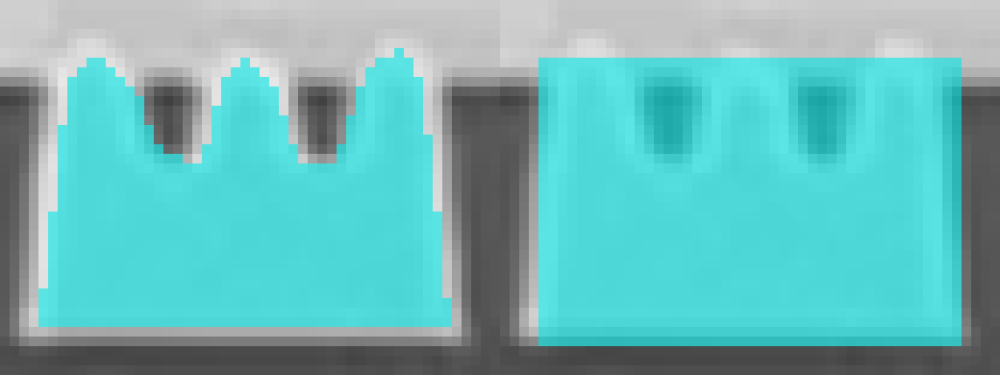
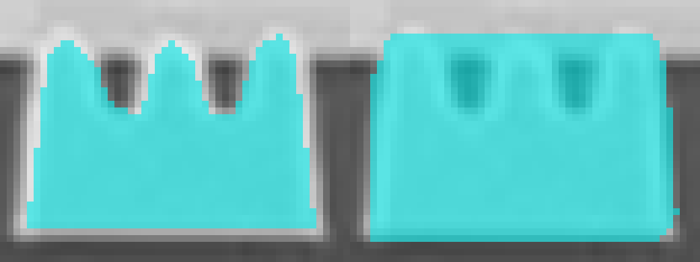

# YOLOE-26 브러시 샘플 및 마스크 경계 검증

2026-10-05 확인 결과: 브러시 샘플을 사각형으로 치환하거나 추론 마스크를 박스로 채우는 오류는 확인되지 않았다. 사용자 산업 이미지에서 YOLOE-26이 작은 홈을 메운 마스크를 예측하는 품질 문제를 재현했다. 현재 모델만으로 해당 부품의 정밀한 경계 라벨링이 충족됐다고 판단할 수 없다.

## 검증 입력과 범위

- 원본: `C:\Users\young\Pictures\sample\sample (3).png`, 1752×1165.
- 세 돌출부와 두 홈이 있는 첫 번째 작은 부품의 윤곽을 수동으로 재현했다. 사용자가 칠한 원본 마스크 파일은 제공되지 않았으므로 사용자 마스크와 픽셀이 완전히 같은 입력은 아니다.
- 재현 마스크의 원본 경계: `[118,482,161,511]`, 43×29. 이를 `sampleMaskGeometry`로 RLE 인코딩해 실제 ONNX worker에 전달했다.
- YOLOE-26 ONNX 모델과 N/S/M/L 모델의 실제 가중치로 WebGPU 추론했다. confidence=0.25, NMS IoU=0.45.
- 샘플과 추론 대상은 같은 원본 이미지이며 클래스는 sampleB 하나다. 여러 클래스·다른 이미지에서의 전체 정확도 평가가 아니다.
- 설치 없는 실행파일의 런타임과 모델 로더를 사용했다. 검증용 worker에는 원시 predictions/prototypes 및 샘플 특징 마스크를 읽기 위한 진단 필드만 추가했으며 추론·후처리 계산은 변경하지 않았다.

## 실제 결과

| 모델 / 입력 | 전체 검출 수 | 지정 부품 신뢰도 | 지정 부품 결과 |
| --- | ---: | ---: | --- |
| N / 640 | 0 | 없음 | 미검출 |
| S / 640 | 10 | 52.1% | 홈을 채운 사각형에 가까운 마스크 |
| S / 1024 | 11 | 75.5% | 두 홈이 복원되지 않음 |
| M / 1024 | 16 | 76.2% | 두 홈이 복원되지 않음 |
| L / 1024 | 8 | 91.3% | 두 홈이 복원되지 않음 |
| N / 2048 | 8 | 66.7% | 검출됐지만 두 홈이 복원되지 않음 |
| S / 2048 | 2 | 31.5% | 두 홈이 복원되지 않음 |
| M / 2048 | 7 | 53.7% | 두 홈이 복원되지 않음 |
| L / 2048 | 9 | 73.0% | 두 홈이 복원되지 않음 |

전체 검출 수는 후보 수이며 정답 개수나 정확도가 아니다. 높은 confidence는 경계 정확도나 픽셀 정답률을 뜻하지 않는다.

아래 비교에서 왼쪽은 재현한 샘플 마스크, 오른쪽은 S/640의 실제 추론 마스크다.

같은 샘플을 S/2048로 실행한 비교도 아래와 같다. 작은 홈이 계속 채워져 나온다. N은 640에서 미검출했던 부품을 2048에서 검출했지만 경계가 복원된 것은 아니다.

2048에서는 샘플 특징 마스크가 256×256이며 재현 샘플의 양성 칸이 21개로 늘었다. 1024의 6칸보다 정보가 많지만 모든 모델에서 두 홈은 복원되지 않았다. 재현한 수동 마스크와 지정 부품 주변 영역의 IoU는 S/640 0.707, S/1024 0.699, S/2048 0.684였다. 이 값은 한 부품의 재현 윤곽 비교이며 데이터셋 정확도 측정이 아니다.

## 2048 구현 및 검증

- 설정의 Inference resolution에 `2048 · Fine details`를 추가했다. 기준 이미지 특징 추출과 대상 추론에 함께 적용하며 Detection·Segmentation 모두 지원한다.
- 기존 가변 해상도 ONNX 가중치를 그대로 사용한다. N/S/M/L 각각 2048에서 ONNX와 PyTorch 출력을 비교해 모두 PASS를 확인하고 manifest를 갱신했다. predictions는 `[1,37,86016]`, prototypes는 `[1,32,512,512]`다.
- 위 산업 이미지의 N/S/M/L 2048 실행은 모두 실제 WebGPU 추론이었다. 진단 코드만 사용한 실행과 UI 테스트를 구분한다.
- 새로 빌드한 `release/yoloe26-2048/win-unpacked/Easy Labeling YOLOE-26.exe`에서도 수정하지 않은 worker로 N/2048 Detection·Segmentation 추론을 각각 실행했다. GPU와 GPU를 비활성화한 CPU 모두 후보 8개를 반환했으며, Detection은 박스, Segmentation은 원본 1752×1165 크기의 실제 마스크를 반환했다. 설정의 2048 선택과 잘못된 960 입력 거부도 확인했다.
- 위 실행파일 검증은 별도 사용자 데이터 디렉터리, Python 경로 차단, 외부 HTTP 통신 차단 상태에서 진행했고 외부 HTTP 요청은 0개였다. 준비와 추론을 합한 한 번의 실행 시간은 N/2048 GPU Detection 2.22초·Segmentation 0.88초, CPU Detection 8.61초·Segmentation 8.36초였다. 세션 재사용·초기화 비용이 달라 이 수치는 일반 성능 벤치마크가 아니다.
- TypeScript 검사, 앱 빌드, 개발용 Python backend 테스트 8개, Detection·Segmentation의 1024/2048 설정·샘플 준비·결과 저장 UI 테스트 4개가 통과했다. UI 테스트는 mock 기반이다.
- 재검증 명령: `uv run --project runtime/yoloe --locked --group export python scripts/verify-yoloe-2048.py`. 이 명령은 개발 검증용이며 배포 앱에 Python을 추가하지 않는다.
- 2048 입력은 1024보다 픽셀 수가 4배다. 처리 시간과 메모리 사용을 고려해 해상도를 선택한다.

주변 400×250 영역을 잘라 S/1024로 실행한 경우 후보 2개가 나왔지만 지정 부품은 검출되지 않았다. 이 사례에서 단순 crop만으로 개선된다는 근거도 확보하지 못했다.

## 데이터 경로와 후처리 확인

1. 브러시·지우개 결과는 `sampleMaskGeometry`에서 최소 경계 영역의 이진 픽셀 마스크로 저장된다. 지운 구멍과 분리된 영역도 보존하며 사각형이나 폴리곤으로 치환하지 않는다.
2. worker의 `masksForReference`는 해당 마스크를 원래 위치에 붙이고 letterbox 및 1/8 샘플 마스크 축소를 적용한다. 1024 입력의 실제 재현 샘플은 128×128 특징 마스크 중 양성 6칸만 차지했다. 640에서는 원본 부품이 약 16×11 입력 픽셀, 샘플 특징 마스크에서 약 2×2칸에 해당한다.
3. 결과 마스크는 모델의 32개 prototype과 해당 검출의 계수로 복원하며, 박스는 범위 제한에 사용한다. preview는 이 픽셀 마스크를 표시한다.
4. 같은 ONNX predictions/prototypes를 로컬 Ultralytics `process_mask_native`로 처리하고 앱의 RLE 결과와 비교했다. N/640, S/640, S/1024, M/1024, L/1024, S/1024 crop의 6개 실행 모두 전체 결과에서 다른 픽셀 수는 **0**이다. Python은 이 개발 검증에만 사용했으며 앱 실행에 추가하지 않았다.
5. 관련 단위 테스트 6개와 Detection/Segmentation 브러시·지우개 UI 테스트 2개로 구멍·분리된 영역·확대 좌표 보존을 확인했다. UI 테스트는 요청 내용을 검증하는 mock 기반 테스트이며 실제 모델 경계 품질의 근거는 위 ONNX 실행이다.

원시 출력, 결과 마스크, 재현 코드와 비교 JSON은 로컬 `output/yoloe-brush-boundary/`에 보관한다. 원시 출력은 Git 배포 자산이 아니다.

## 해석과 개선 방향

샘플 윤곽은 시각 특징을 추출하기 위한 입력이고 결과 윤곽을 강제하는 템플릿이 아니다. 대상이 매우 작고 일반 객체와 다른 산업 도메인인 이 사례에서는 샘플과 출력의 해상도 손실 및 모델의 경계 추정 한계가 드러났다. 1024·2048이나 큰 모델로 바꾸는 것만으로 해결됐다는 결과는 없다.

현재 결과를 검토용 초안으로 사용하고 브러시·지우개로 정밀 보정해야 한다. 자동으로 홈까지 유지하려면 후보 검출 후 별도 경계 보정을 실제 데이터로 검증하거나 도메인 마스크로 학습해야 한다. 이 검증에서는 새로운 자동 보정 알고리즘을 적용하거나 개선 효과를 주장하지 않았다.

- 공식 시각 프롬프트 설명: https://docs.ultralytics.com/models/yoloe/
- 공식 마스크 복원 기준: https://docs.ultralytics.com/reference/utils/ops/#ultralytics.utils.ops.process_mask_native
